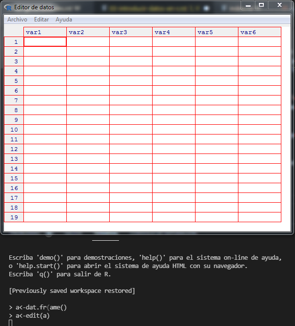
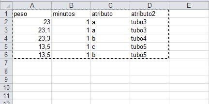
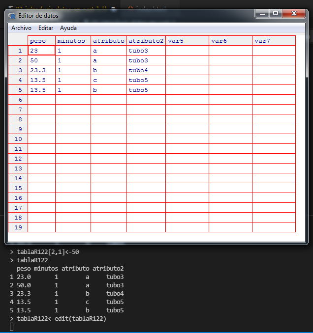

Introducir datos en R
==========================================

Para esta clase usted trabajará con datos de la planilla de cálculo ``tablaR1-2.ods/xls``. La misma la
hallará entre el material de la clase

Introducción de datos en R
---------------------------------

Los datos y los resultados se almacenan en en el espacio de trabajo de R_ en lo que llamamos
objetos. Dentro de los objetos para almacenar datos, los más comunes son

- vectores
- data.frames
- matrices

Cada uno de ellos tiene características que los hacen más ventajosos para ciertas aplicaciones.

Tablas: data.frame
~~~~~~~~~~~~~~~~~~~~~~~~~~

Los ``data.frame`` son tablas con columnas y filas. Pueden almacenar datos numéricos y caracteres y
en general cualquier tipo de datos. Se asemeja a una planilla de cálculo. Una característica
importante es que cada columna debe contener el mismo tipo de datos, por ejemplo una columna
puede ser edad, es decir un dato numérico y para todas las filas, deberá ser numérico.
Contrariamente una fila puede tener en cada columna datos de diferente tipo.

- Creación de un ``data.frame``: a continuación veremos como crear un ``data.frame`` y como ingresar datos en él.

Ingreso de datos manualmente en R
~~~~~~~~~~~~~~~~~~~~~~~~~~~~~~~~~~~~

La forma más fácil de ingresar datos en un ``data.frame`` es con el siguiente código y sirve para
cuando debemos cargar datos directamente en R_.

En primer lugar creamos un ``data.frame`` vacío. En el ejemplo vemos el código para crear un
``data.frame`` de nombre ``a``

.. code-block:: R
    
    > a<-data.frame()

Con el código siguiente abrimos el ``data.frame`` en una interfaz amigable, donde podemos ingresar
datos y cambiar nombre a columnas.

.. code-block:: R
    
    > a<-edit(a)

Haciendo click con el botón derecho del mouse sobre ``var1``, ``var2``, etc se despliega un pequeño menú
que nos permite cambiar nombre de la columna y tipo de datos. Al crear el ``data.frame`` con el código
anterior, R_ no coloca nombre a las columnas. Si deseáramos crear el mismo ``data.frame`` pero
teniendo nombre de columnas, por ejemplo que la columna :math:`1` sea ``nombre`` y la segunda ``edad``,
podemos utilizar el código

.. code-block:: R
    
    > a<-data.frame(nombre="NA",edad="NA")

si vemos el contenido de ``a``

.. code-block:: R
    
    > a
      nombre edad
    1     NA   NA

tenemos las dos columnas con la primer fila vacía. También podríamos ya crear el data.frame
introduciendo el primer elemento de la tabla o en realidad cualquiera, ya que luego podremos
fácilmente modificarlo.

.. code-block:: R
    
    > a<-data.frame(nombre="Pérez",edad=39)

vemos el contenido

.. code-block:: R
    
    > a
      nombre edad
    1  Pérez   39

Con el tiempo irá conociendo otras formas más eficientes, más rápidas y más adecuadas a cada
situación, para la introducción de datos en un ``data.frame``.

Introducir al espacio de trabajo datos de una planilla de cálculo
~~~~~~~~~~~~~~~~~~~~~~~~~~~~~~~~~~~~~~~~~~~~~~~~~~~~~~~~~~~~~~~~~~~~~~~~~~~~~~~~~~

Otra forma de introducir datos al espacio de trabajo es importándola desde una planilla de cálculo.
Un detalle importante en este método es que debemos tener muy claro si el separador decimal
utilizado en la planilla es "``.``" o "``,``".

Procedimiento: Utilice para este ejercicio la ``tablaR121`` de la planilla de cálculo ``tablaR1-2.xls/ods``.
Teniendo abierto R_ en nuestro espacio de trabajo y la planilla de cálculo, marcamos la parte de la
planilla que queremos introducir, la copiamos al portapapeles,

luego vamos a R_ y escribimos el siguiente código

.. code-block:: R
    
    > tablaR121<-read.table("clipboard", header=TRUE, dec=",")

Este código se utiliza si copiamos una planilla con los encabezamientos de columnas y los números
están en coma decimal. Ya veremos problemas y soluciones que se pueden presentar en casos
específicos.

Para ir familiarizándonos con la terminología, en la línea de comando anterior, ``read.table()`` es una
función de R_ que ejecuta algo, en este caso introduce datos desde el portapapeles a un objeto, que
en este caso se le dió el nombre ``tablaR121``. Dentro de la función figura lo que llamamos
argumentos.

- El argumento ``header=....`` , este caso tomó el valor ``TRUE``, ``header=TRUE``,
  le indica a la función que la primer línea de lo que hemos copiado son los encabezamientos
  de columnas y por ende los asignará a los nombres de columnas del ``data.frame``.

- El argumento ``dec=","``, le indica a la función ``read.table()`` que en nuestra planilla de
  cálculo la división decimal de los números se hace con una "``,``".

Para comprobar si los datos fueron correctamente incorporados al espacio de trabajo, le pedimos a
R_ el objeto creado "``tablaR121``"

.. code-block:: R
    
    > tablaR121
      peso minutos atributo atributo2
    1 23.0       1        a     tubo3
    2 23.1       1        a     tubo3
    3 23.3       1        b     tubo4
    4 13.5       1        c     tubo5
    5 13.5       1        b     tubo5

vemos los datos de la planilla de cálculo y podemos comprobar que los mismos se han introducido
con punto decimal.

Importar datos de una planilla de cálculo al espacio de trabajo
~~~~~~~~~~~~~~~~~~~~~~~~~~~~~~~~~~~~~~~~~~~~~~~~~~~~~~~~~~~~~~~~~~~~~~~~~~~~~~~~~~

Se puede importar una planilla de cálculos completa. Si bien hay numerosas opciones y usted irá
definiendo con el tiempo cual le resulta más adecuada, para comenzar se recomienda hacerlo a
partir de archivos con extensión ``.csv`` (comma separated values). Seguramente usted tendrá algunas
dificultades hasta hallar las condiciones óptimas. Se muestra un mecanismo en este caso
desarrollado en ``Calc`` (planilla de ``libreOffice``).

1. A partir de la hoja ``tablaR121`` de la planilla de cálculo ``tablaR1-2ods/xls``,
   grabe el archivo en formato ``csv``, con el nombre ``tablaR121.csv``. En el proceso elija

.. code-block:: R
    
    Character set: Unicode
    Field delimiter: {Tab}
    text delimiter: "

Si tuviera dificultades para crearla utilice el archivo ``tablaR121.csv``.

Para ejecutar la acción siguiente es importante que el archivo ``tablaR21.csv`` se halle
ubicado en el mismo directorio en que se halla su espacio de trabajo.

1. desde R_ ejecute la siguiente linea de comandos.

.. code-block:: R
    
    > tablaR121<-read.table("tablaR121.csv",header=TRUE,sep="\t",
        fileEncoding ="Unicode", dec=",")

A continuación explicamos los argumentos de la función ``read.table()``

- ``header= TRUE`` (o ``FALSE``) indica si se utilizarán los encabezados de columnas como
  títulos de las columnas de nuestro objeto o no. En este caso sí utilizamos los encabezamientos
  o nombres de las columnas.

- ``sep="\t"`` indica que utilizamos como ``Field delimiter {Tab}``. Es decir quedan separados
  por tabulador los valores de cada columna dentro de una fila.

- ``fileEncoding= "Unicode"``, indica que utilizamos ese modo de codificación en ``Character set``.
  ``dec=","``, indica que en nuestra planilla utilizamos como separador de parte entera de decimal
  a la coma ``","``.

La operación de guardar un archivo ``.csv`` puede traer dificultades y según los sistemas operativos o
la configuración de éstos, puede ocurrir que no se puedan aplicar las opciones mencionadas
directamente. Puede probar otras opciones. Coloque en su planilla de cálculo
guardar como y elija ``.csv``, pero elija como ``Field delimiter: ;``.

.. warning::
    
    - **NO** elija ningún tipo de codificación y deje la que le sugiere su sistema.

Luego ejecute el código siguiente, probando en el argumento ``sep`` diferentes
opciones: ``"\t"``, ``","``, ``";"``. Seguramente alguna le funcionará.

.. code-block:: R
    
    > tablaR121<-read.table("tablaR121.csv",header=TRUE,sep=";", dec=",")

Si no anda con un poco de trabajo hallará cual es la opción para su sistema. Sin embargo, recuerde
que siempre funciona la opción

.. code-block:: R
    
    > tablaR121<-read.table("clipboad",header=TRUE,sep="\t", dec=",")

Creación de ``data.frame`` a partir de vectores existentes en el espacio de trabajo
~~~~~~~~~~~~~~~~~~~~~~~~~~~~~~~~~~~~~~~~~~~~~~~~~~~~~~~~~~~~~~~~~~~~~~~~~~~~~~~~~~~~~~

Creación de ``data.frame`` a partir de vectores existentes en el espacio de trabajo.

Si se desea que un ``data.frame`` tenga dos columnas, la primera con los datos del objeto "``a``" y la
segunda con los datos del objeto "``c``", se asigna el nombre del objeto, por ejemplo "``tabla1``" y el
siguiente código asigna las columnas. Por defecto R pone los vectores como columnas.

Usted debe tener creados del módulo anterior los vectores ``a`` y ``c``, sino créelos nuevamente

.. code-block:: R
    
    > a<-c(1,2,3,4,5)
    > c<-c("x","y","z","u","v")
    > tabla1<-data.frame(a,c)
    > # vemos el contenido del objeto tabla1
    > tabla1
      a c
    1 1 x
    2 2 y
    3 3 z
    4 4 u
    5 5 v
    >

La forma de creación mostrada es equivalente a ejecutar

.. code-block:: R
    
    > tabla1<-data.frame(cbind(a,c))
    > tabla1
      nombre edad c
    1  Pérez   39 x
    2  Pérez   39 y
    3  Pérez   39 z
    4  Pérez   39 u
    5  Pérez   39 v

La función ``cbind()`` lo que hace es unir los vectores ubicándolos en columnas. Veremos esta función
más adelante para fusionar ``data.frames``.

Si utilizamos la función ``rbind``, formará un data frame, pero cada vector ocupará una fila

.. code-block:: R
    
    > tabla2<-data.frame(rbind(a,c))
    > tabla2
      X1 X2 X3 X4 X5
    a  1  2  3  4  5
    c  x  y  z  u  v

crear nuevo data frame a partir de un data.frame existente
~~~~~~~~~~~~~~~~~~~~~~~~~~~~~~~~~~~~~~~~~~~~~~~~~~~~~~~~~~~~~~~~~~~~~~~~~~~~~~~~~~

Si se desea formar otra tabla (``tabla3``) que tenga los mismos datos que ``tabla1``, donde agregaremos
una columna "``y``" con datos que son una función de "``a``", en este caso los valores de ``a+1``

.. code-block:: R
    
    > tabla3<-data.frame(tabla1,y=a+1)
    > tabla3
      a c y
    1 1 x 2
    2 2 y 3
    3 3 z 4
    4 4 u 5
    5 5 v 6
    >

Otra formas de crear data.frames
~~~~~~~~~~~~~~~~~~~~~~~~~~~~~~~~~~~~~~~~~~~~~~~~~~~~~~~~~~~~~~~~~~~~~~~~~~~~~~~~~~

Si se le quiere poner nombre a las columnas donde se ubicarán los vectores ``a`` y ``b``,
utilizamos el siguiente código

.. code-block:: R
    
    > tabla1<-data.frame(A=a,C=c)
    > tabla1
      A C
    1 1 x
    2 2 y
    3 3 z
    4 4 u
    5 5 v

Con el avance del curso irá aprendiendo otras formas de introducir datos en un ``data.frame``,
siendo la oferta casi inagotable.

Conocer las características del data frame
~~~~~~~~~~~~~~~~~~~~~~~~~~~~~~~~~~~~~~~~~~~~~~~~~~~~~~~~~~~~~~~~~~~~~~~~~~~~~~~~~~

Un data.frame no tiene límite conocido de cantidad de filas y columnas, por lo que cuando son muy
grandes tener una idea del tipo de datos almacenados es un problema. La función ``str()`` soluciona ese
problema haciéndonos un resumen. Veamos por ejemplo para la ``tablaR121``

.. code-block:: R

    > str(tablaR121)
    'data.frame':   5 obs. of  3 variables:
     $ peso    : num  23 23.1 23.3 23.5 23.6
     $ minutos : int  1 1 1 1 1
     $ atributo: chr  "a" "a" "b" "c" ...

- La primer línea nos indica: 5 obs (5 filas) of 3 variables (3 columnas)

- La segunda línea: ``$ peso:`` nos indica que la primer columna contiene datos numéricos
  y nos indica los valores. Cuando son muchos nos mostrará sólo una parte

- La tercer línea ``$ minuto:`` nos indica que la columna siguiente contiene datos enteros.
  Para ello utiliza ``int``.

- La cuarta línea ``$ atributo:`` nos indica que esta columna contiene un factor, es decir
  una variable categórica, que en este caso tiene :math:`3` niveles (:math:`3` levels) y
  nos indica los niveles existentes: ``a``, ``b`` y ``c``.

Luego nos da el orden en que se hallan en las primeras filas: ``1``, ``1``, ``2``, ``3``, ``2``
está indicando ``a``, ``a``, ``b``, ``c``, ``b``.

ver una columna
~~~~~~~~~~~~~~~~~~~~~~~~~~~~~~~~~~~~~~~~~~~~~~~~~~~~~~~~~~~~~~~~~~~~~~~~~~~~~~~~~~

Retomemos el trabajo con el ``data.frame`` ``tablaR121``. Visualicémoslo

.. code-block:: R

    > tablaR121
      peso minutos atributo
    1 23.0       1        a
    2 23.1       1        a
    3 23.3       1        b
    4 23.5       1        c
    5 23.6       1        b

Si deseáramos ver solo la columna peso utilizaremos el código

.. code-block:: R
    
    > tablaR121$peso
    [1] 23.0 23.1 23.3 23.5 23.6

o la columna atributo

.. code-block:: R
    
    > tablaR121$atributo
    [1] "a" "a" "b" "c" "b"

que nos muestra los datos consecutivos de la columna y luego los niveles existentes

.. note::
    
    - cuando escribimos el nombre del ``data.frame`` seguido de ``$`` y el nombre de
      una columna, estamos haciendo un llamado a esa columna del ``data.frame``. Por
      ejemplo ``tablaR121$peso``, llama la columna peso del ``data.frame`` ``tablaR121``.
      Como veremos más adelante este código no sólo sirve para ver la columna.

Cambiar valores de un data.frame
~~~~~~~~~~~~~~~~~~~~~~~~~~~~~~~~~~~~~~~~~~~~~~~~~~~~~~~~~~~~~~~~~~~~~~~~~~~~~~~~

Introduzcamos en nuestro espacio de trabajo la ``tablaR122`` de nuestra planilla de cálculo
``tablaR1-2.ods/xls``. Para ello utilicemos cualquier de los dos métodos vistos anteriormente.
Por ejemplo:

.. code-block:: R
    
    > tablaR122<-read.table("clipboard", header=TRUE, dec=",")

vemos los datos introducidos

.. code-block:: R

    > tablaR122
      peso minutos atributo atributo2
    1 23.0       1        a     tubo3
    2 23.1       1        a     tubo3
    3 23.3       1        b     tubo4
    4 13.5       1        c     tubo5
    5 13.5       1        b     tubo5
    >

para cambiar un número en una tabla se debe indicar numero de fila y columna. Por ejemplo si
deseamos cambiar el valor ``23.1`` de la fila :math:`2` y columna :math:`1` por el valor ``50``,
se escribe el nombre del ``data.frame`` y entre corchetes, la fila y la columna,
como lo indica el código siguiente:

.. code-block:: R
    
    > tablaR122[2,1]<-50

vemos como quedó el ``data.frame``

.. code-block:: R
    :emphasize-lines: 4

    > tablaR122
      peso minutos atributo atributo2
    1 23.0       1        a     tubo3
    2 50.0       1        a     tubo3
    3 23.3       1        b     tubo4
    4 13.5       1        c     tubo5
    5 13.5       1        b     tubo5

con énfasis, observamos el cambio logrado.

Otra forma más sencilla es utilizar el comando

.. code-block:: R
    
    > tablaR122<-edit(tablaR122)

que abrirá una ventana de edición en un formato más amigable, que se muestra a continuación

en esta tabla cambiamos el valor y luego oprimimos "``Quit``".
El comando mostrado permite abrir un ``data.frame``, modificar los datos y guardar los cambios.

Si usted hubiera ejecutado el comando

.. code-block:: R
    
    > edit(tablaR122)

ingresará al mismo sitio, podrá modificar datos si desea, pero cuando oprima ``Quit``, esto no se
grabarán en el ``data.frame``, ya que no los asignó nuevamente al objeto con ``<-``. El comando

.. code-block:: R
    
    > edit(tablaR122)

es muy útil cuando desea ver datos de un ``data.frame``, pero no modificarlos.

Guardar y cargar data.frame en espacio de trabajo
~~~~~~~~~~~~~~~~~~~~~~~~~~~~~~~~~~~~~~~~~~~~~~~~~~~~~~~~~~~~~~~~~~~~~~~~~~~~~~~~~~

Supongamos que deseamos enviar datos en un ``data.frame`` o bien utilizarlos en otro espacio de
trabajo. Un recurso interesante es grabar el data.frame en un archivo independiente que luego puede
ser introducido en otro espacio de trabajo

Tomemos el ``data.frame`` ``tablaR122`` que estamos utilizando. Lo guardamos como un archivo con el
siguiente código.

.. code-block:: R
    
    > save(tablaR122,file="tablaR122")

esto nos creará una archivo llamado ``tablaR122`` que tendrá los datos del data frame, el cual quedará
en el directorio en el que estamos trabajando. Puede comprobar esto utilizando un administrador de
archivos.

Recuerde que para conocer en que directorio está trabajando puede ejecutar el comando.

.. code-block:: R
    :emphasize-lines: 2
    
    > getwd()
    [1] "D:/Documents/posgrado/UNR/R"

cuyo resultado es en mi computadolr, lo qu se esá mostrando con énfasis.

Si quisiera utilizar el data.frame en otro espacio de trabajo, copie el archivo
al directorio donde se halla su nuevo espacio de trabajo y luego desde el espacio
de trabajo ejecute

.. code-block:: R
    
    > load("tablaR122")
    > ls()
     [1] "a"               "aa"              "b"               "bb"
     [5] "c"               "horasdedescanso" "horasdesol"      "myvector"
     [9] "qq"              "sexos"           "tabla1"          "tabla2"
    [13] "tabla3"          "tablaR121"       "tablaR122"       "zzz"

comprobará con la función ``ls()`` que ahora tiene un ``data.frame`` llamado
``tablaR122`` con los datos.

Para comprobar en este momento como funciona, elimine el ``data.frame``
``tablaR122`` de su espacio de trabajo. Para ello ejecute

.. code-block:: R
    
    > rm(tablaR122)

luego compruebe si está el objeto ``tabla122``, pidiendo el el objeto

.. code-block:: R
    
    > tablaR122
    Error: objeto 'tablaR122' no encontrado

Ahora vuelva a introducir el ``data.frame`` que borró, pero que anteriormente
había salvado como un archivo.

.. code-block:: R
    
    > load("tablaR122")

pida a R_ el objeto introducido

.. code-block:: R
    
    > tablaR122
      peso minutos atributo atributo2
    1 23.0       1        a     tubo3
    2 30.0       1        a     tubo3
    3 23.3       1        b     tubo4
    4 13.5       1        c     tubo5
    5 13.5       1        b     tubo5

Advertirá que es un buen recurso para enviar datos a personas con las que se encuentra trabajando
sobre un mismo proyecto y por supuesto, que utilizan R_.

Conocer qué tipo de objeto es uno de ellos: ``matrix``, ``data.frame``, ``array``, ``vector``
~~~~~~~~~~~~~~~~~~~~~~~~~~~~~~~~~~~~~~~~~~~~~~~~~~~~~~~~~~~~~~~~~~~~~~~~~~~~~~~~~~~~~~~~~~~~~~

En nuestros espacios de trabajo se irán juntando objetos, por ende es prioritario definir
una política de asignación de nombre. En el desarrollo de esta clase llamamos a los objetos
``tablaRxyz``, cuando son ``data.frames``, por ejemplo. Usted puede elegir su propio y más
intuitiva forma. Los nombres largos si bien son claros, al tener cientos de objetos puede
ser dificultoso hallarlos.

Independientemente de la eficiencia que tenga en el trabajo de nombrar objetos, R_ nos da
el recurso de saber si es una ``data.frame``, ``matrix``, ``array`` o ``vector``.

- La función ``is.matrix()``, la utilizamos para saber si es una matriz.
  Esta nos devolverá ``TRUE`` o ``FALSE``, si el argumento es o no este tipo de objeto.
  En el caso de ``tablaR122``, la creamos como ``data.frame``

.. code-block:: R

    > is.matrix(tablaR122)
    [1] FALSE

- La función ``is.data.frame()`` nos devuelve ``TRUE`` si el arguemento es un ``data.frame``
  ó ``FALSE`` en caso contrario. 

.. code-block:: R
    
    > is.data.frame(tablaR122)
    [1] TRUE

- La función ``is.vector()``, nos devuelve ``TRUE`` si el arguemento es un vector ó ``FALSE``
  en caso contrario.

.. code-block:: R
    
    > is.vector(tablaR122)
    [1] FALSE

- La función ``is.array()``, nos devuelve ``TRUE`` si el arguemento es un array ó ``FALSE``
  en caso contrario.

.. code-block:: R
    
    > is.array(tablaR122)
    [1] FALSE

Convertir objetos
~~~~~~~~~~~~~~~~~~~~~~~~~~~~~~~~~~~~~~~~~~~~~~~~~~~~~~~~~~~~~~~~~~~~~~~~~~~~~~~~~~

Supongamos que deseamos convertir el objeto ``tablaR122`` que es un ``data.frame`` en una matriz.
Para ello utilizamos el siguiente código

.. code-block:: R
    
    > tablaR122matrix<-as.matrix(tablaR122)

podemos comprobar que el objeto obtenido no es un ``data.frame``, a pesar que ``tablaR122`` lo era.

.. code-block:: R

    > is.data.frame(tablaR122matrix)
    [1] FALSE

podemos verificar que el proceso lo transformó en un objeto del tipo matriz

.. code-block:: R
    
    > is.matrix(tablaR122matrix)
    [1] TRUE

Detalle sobre nombres de objetos
----------------------------------------------------------------------------------

Los nombres de los objetos no pueden llevar los siguientes caracteres ni espacios

.. code-block:: none
    
    ~ ! @ # $ % ^ & * ( ) { } _ : " < > ? , . / ; ' [ ] - =

Si bien pueden llevar números, estos no pueden iniciar el nombre del objeto.
Es permitido un objeto llamado ``datos1``, pero no ``12perros``.

Es muy sencillo de recordar, solo utilice palabras y números, evite letras acentuadas.
Si desea que un objeto refleje su contenido puede utilizar mayúsculas por ejemplo

.. code-block:: R
    
    DatosDeExperimentoDelDia<-c(...)

.. _R: https://www.r-project.org/

.. code-block:: R
    
    > vector1<-c("x","t","t","z")
    > vector2<-c("a","a","a","a")
    > sumatoria<-data.frame(vector1,vector2)
    > sumatoria
      vector1 vector2
      1       x       a
      2       t       a
      3       t       a
      4       z       a
    > vector3<-c(3,4,5,6)
    > datos$importantes<-read.table("clipboard",header=TRUE, dec=",")