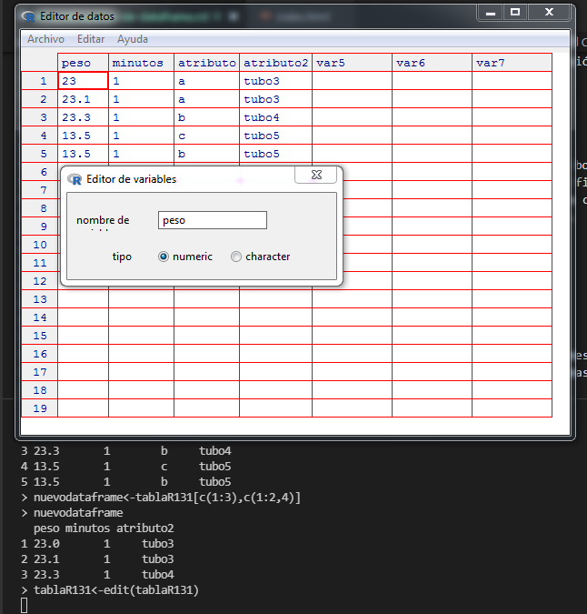

Continuación uso de data.frames
=================================

Reemplazo de valores de un data.frame
-----------------------------------------

En el módulo anterior vimos el reemplazo de valores en un ``data.frame`` utilizando
el comando ``edit()`` y asignando valores por filas y columnas. Veamos ahora otras
formas útiles para realizar reemplazos.

Reemplazar valores de un nivel con la función gsub()
~~~~~~~~~~~~~~~~~~~~~~~~~~~~~~~~~~~~~~~~~~~~~~~~~~~~~

Cuando se desea realizar un reemplazo a lo largo de todo un ``data.frame`` o una
columna de éste, se puede optar por un método que busque lo que se quiera reemplazar
y en su lugar colocar el valor deseado. Este método es similar a las funciones
"``find & replace``" o "buscar y reemplazar" de procesadores de texto y planillas
de cálculo.

En este caso se utiliza la función ``gsub()``.

Utilizaremos la ``tablaR131`` de la planilla de cálculo ``tablaR1-3.xls/ods``
adjunta a esta clase. En primer lugar introduzca esta tabla utilizando

.. code-block:: R
    
    > tablaR131<-read.table("clipboard",header=TRUE,dec=",",sep="\t")

vemos la tabla introducida

.. code-block:: R
    
    > tablaR131
      peso minutos atributo atributo2
    1 23.0       1        a     tubo3
    2 23.1       1        a     tubo3
    3 23.3       1        b     tubo4
    4 13.5       1        c     tubo5
    5 13.5       1        b     tubo5

queremos reemplazar en la columna ``atributo2``, "``tubo``" por "``t``". Para ello a la columna atributo
debemos reemplazarla por los datos modificados.

- La función ``gsub()`` tendrá el siguiente formato.

.. code-block:: R
    
    > tablaR131$atributo2<-gsub("tubo","t",tablaR131$atributo2)

si observamos ahora la tabla

.. code-block:: R
    
    > tablaR131
      peso minutos atributo atributo2
    1 23.0       1        a        t3
    2 23.1       1        a        t3
    3 23.3       1        b        t4
    4 13.5       1        c        t5
    5 13.5       1        b        t5

Obtener una resumen de un data.frame
-------------------------------------

Cuando deseamos conocer el contenido de un ``data.frame`` en lo que se refiere a nombre de las
columnas, tipo de variables y niveles de cada variable cualitativa, es recomendable la función
``summary()``

.. code-block:: R 
    
    > summary(tablaR131)
      peso          minutos    atributo          atributo2
     Min.   :13.50   Min.   :1   Length:5           Length:5
     1st Qu.:13.50   1st Qu.:1   Class :character   Class :character
     Median :23.00   Median :1   Mode  :character   Mode  :character
     Mean   :19.28   Mean   :1
     3rd Qu.:23.10   3rd Qu.:1
     Max.   :23.30   Max.   :1

Las variables numéricas se indican con estadísticas descriptivas:

- ``min``,
- ``max``, 
- ``mediana``,
- ``media``,
- ``primer`` y ``tercer cuartilo``.
 
Las variables cualitativas que se hallan factorizadas se indican los niveles y
el número de unidades de cada nivel, por ejemplo la variable atributo, en la
cual se indican los niveles: ``a``, ``b`` y ``c`` con ``2``, ``2`` y ``1``
apariciones, respectivamente. Otras variables como ``atributo2`` que tiene
datos cualitativos pero no caracterSizados por nivel, se indica el tipo de
datos: ``character``. Podría, como veremos más adelante, transformarse en nivel
del factor ``atributo2``. También veremos que para ciertas aplicaciones una variable
conviene que sea ``caracter`` o ``factor``.

Cambiar nombre de las columnas de un data frame
-------------------------------------------------

A menudo necesitamos cambiar nombre de las columnas.

Utilizando la función names()
~~~~~~~~~~~~~~~~~~~~~~~~~~~~~~~~~~~~~~~~~~~~~~~~~

En el ``data.frame`` que acabamos de crear, las columnas tienen los nombres:

- ``peso``,
- ``minutos``,
- ``atributo`` y
- ``atributo2``.

.. code-block:: R
    
    > tablaR131
      peso minutos atributo atributo2
    1 23.0       1        a        t3
    2 23.1       1        a        t3
    3 23.3       1        b        t4
    4 13.5       1        c        t5
    5 13.5       1        b        t5

deseamos cambiar el nombre de la columna ``atributo2`` por "``atr``"

.. code-block:: R
    
    > names(tablaR131)<-c("peso","minutos","atributo","atr")
    > tablaR131
      peso minutos atributo atr
    1 23.0       1        a  t3
    2 23.1       1        a  t3
    3 23.3       1        b  t4
    4 13.5       1        c  t5
    5 13.5       1        b  t5

Es importante notar que se deben indicar en el vector el nombre de todas las
columnas aunque solo se cambie el nombre de una de ellas.

A través de la función edit()
~~~~~~~~~~~~~~~~~~~~~~~~~~~~~~~

Se puede editar la tabla, en el modo modificación, es decir asignado ``edit()``
a la misma tabla o a otra.

En el caso que veremos a continuación modificaremos la ``tablaR131``, pero la modificación
no se hará en esta tabla, sino que se asignará a otra tabla que llamamos ``tabla1``.

.. code-block:: R
    
    > tabla1<-edit(tablaR131)

hacer click sobre el nombre de la columna y elegir cambiar nombre. Se debe borrar el nombre y
escribir el deseado. Recuerde que para que el cambio sea permanente debe utilizar el código
indicado anteriormente. Si utiliza el código

.. code-block:: R
    
    > edit(tablaR131)

podrá hacer la modificación pero no quedará guardado en el objeto, ya que no lo está asignando al
mismo. Si utilizará el código

.. code-block:: R
    
    > tablaR131<-edit(tablaR131)

las modificaciones introducidas se asignarán a la misma tabla, no creándose otro objeto, como
ocurrió en el primer caso.

Insertar datos con nombre de columna
-------------------------------------

Si al ``data.frame`` ``tablaR131`` le deseo agregar una nueva columna, a partir de datos de un vector
(``vector1``) y deseo que la columna se llame ``variable3``. **El vector tiene que tener la misma cantidad de
datos que las filas del** ``data.frame``.

Primeramente declaramos e inicializamos el vector llamado vector1

.. code-block:: R
    
    > vector1<-c("x","x","x","x","y")
    > vector1
    [1] "x" "x" "x" "x" "y"

lo agregamos a la ``tablaR131`` con la función ``cbind()`` que permite fusionar ``data.frames``
entre sí o con vectores. Esta función agregará el ``vector1`` como una columna a continuación
del ``data.frame`` ``tablaR131``, que en este caso introducimos con el nombre columna: ``variable3``.
  
Puede utilizarse el nombre que desee para la columna.

.. code-block:: R
    
    > tablaR131<-cbind(tablaR131,variable3=vector1)
    > tablaR131
      peso minutos atributo atr variable3
    1 23.0       1        a  t3         x
    2 23.1       1        a  t3         x
    3 23.3       1        b  t4         x
    4 13.5       1        c  t5         x
    5 13.5       1        b  t5         y

si hubiéramos escrito

.. code-block:: R
    
    > tablaR131<-cbind(variable3=vector1, tablaR131)

pondría en la primer columna el ``vector1`` y luego el ``dataframe``.

Ordenar datos en un data.frame
--------------------------------

Ordenamiento creciente
~~~~~~~~~~~~~~~~~~~~~~~~~~~

Habitualmente necesitamos ordenar los datos de un ``data.frame`` en forma
creciente o decreciente, por los valores de una o más columnas.

- La función ``order()``. Trabajaremos con el ``data.frame`` ``tablaR131``

.. code-block:: R

    > tablaR131
      peso minutos atributo atr variable3
    1 23.0       1        a  t3         x
    2 23.1       1        a  t3         x
    3 23.3       1        b  t4         x
    4 13.5       1        c  t5         x
    5 13.5       1        b  t5         y

queremos ordenarlo primero por la columna ``peso`` (columna :math:`1`) y luego
por ``atributo`` (columna :math:`3`).

Para ello utilizamos el siguiente código.

.. code-block:: R
    
    > tablaR131[order(tablaR131[,1],tablaR131[,3]),]
      peso minutos atributo atr variable3
    5 13.5       1        b  t5         y
    4 13.5       1        c  t5         x
    1 23.0       1        a  t3         x
    2 23.1       1        a  t3         x
    3 23.3       1        b  t4         x

también puede ejecutarse con el código siguiente, indicando el nombre de
la columna, separada del ``data.frame`` por el signo ``$``

.. code-block:: R
    
    > tablaR131[order(tablaR131$peso,tablaR131$atributo),]
      peso minutos atributo atr variable3
    5 13.5       1        b  t5         y
    4 13.5       1        c  t5         x
    1 23.0       1        a  t3         x
    2 23.1       1        a  t3         x
    3 23.3       1        b  t4         x

En ambos casos logré el ordenamiento, pero dicho orden es visible en pantalla,
pero no se almacena en el ``data.frame``. Si deseara ordenarlo y sobreescribir
el ``data.frame`` debería utilizar

.. code-block:: R
    
    > tablaR131<- tablaR131[order(tablaR131[,1],tablaR131[,3]),]
    > tablaR131
      peso minutos atributo atr variable3
    5 13.5       1        b  t5         y
    4 13.5       1        c  t5         x
    1 23.0       1        a  t3         x
    2 23.1       1        a  t3         x
    3 23.3       1        b  t4         x

Ordenamiento creciente y decreciente
~~~~~~~~~~~~~~~~~~~~~~~~~~~~~~~~~~~~~

Se utiliza el caracter "``-``" delante de la columna que se desea ordenar,
el ordenamiento se realizará en forma decreciente. En el caso siguiente ordenamos
en forma decreciente por el ``peso`` y creciente por la columna ``atributo``.

.. code-block:: R
    
    > tablaR131[order(-tablaR131$peso,tablaR131$atributo),]
      peso minutos atributo atr variable3
    3 23.3       1        b  t4         x
    2 23.1       1        a  t3         x
    1 23.0       1        a  t3         x
    5 13.5       1        b  t5         y
    4 13.5       1        c  t5         x

Operaciones con datos de un data.frame
--------------------------------------------

Veamos la aplicación de operaciones, utilizando el objeto ``tablaR131`` que hemos creado.
El objeto lo hemos modificado así que podemos introducirlo nuevamente en el espacio de
trabajo con el código conocido, copiando nuevamente los datos de la tabla.

.. code-block:: R
    
    > tablaR131<-read.table("clipboard",header=TRUE,dec=",",sep="\t")

el objeto quedará

.. code-block:: R
    
    > tablaR131
      peso minutos atributo atributo2
    1 23.0       1        a     tubo3
    2 23.1       1        a     tubo3
    3 23.3       1        b     tubo4
    4 13.5       1        c     tubo5
    5 13.5       1        b     tubo5

Si deseamos obtener la suma de los valores de la columna ``peso`` (columna :math:`1`)

.. code-block:: R
    
    > sum(tablaR131[,1])
    [1] 96.4

La acción anterior también la podemos ejecutar con el siguiente comando

.. code-block:: R
    
    > sum(tablaR131$peso)
    [1] 96.4

Recuerde que si deseo hacer referencia a la columna :math:`1`, que en este
caso es el ``peso``, estas opciones son equivalentes

.. code-block:: R
    
    > tablaR131[,1]
    [1] 23.0 23.1 23.3 13.5 13.5
    > tablaR131$peso
    [1] 23.0 23.1 23.3 13.5 13.5

Si deseamos la **media** de los datos de esa columna

.. code-block:: R
    
    > mean(tablaR131[,1])
    [1] 19.28

Supongamos que deseamos la media de los datos de la columna :math:`1`,
pero solo las :math:`3` primeras filas. En el corchete verá dos partes
separadas por "``,``". La primer parte indica las filas, en este caso
se toman las filas :math:`1` a :math:`3`, por eso se expresa ``c(1:3)``.
Los "``:``" indican desde :math:`1` a :math:`3`. Si utilizara ``c(1,3)``,
estaría tomando la fila :math:`1` y :math:`3`, pero no la :math:`2`.
En la segunda parte del corchete se indican las columnas. En este caso solo
tomamos la columna :math:`1`. Note que cuando se coloca una fila o columna,
se utiliza solo el número. En cambio si se desea seleccionar dos o más filas
o columnas, se expresa como un vector con la forma ``c(......)``

.. code-block:: R

    > mean(tablaR131[c(1:3),1])
    [1] 23.13333

En el ejemplo siguiente hallaremos la media de la primer columna,
pero solo incluyendo las :math:`3` primeras filas y la última

.. code-block:: R
    
    > mean(tablaR131[c(1:3,5),1])
    [1] 20.725

Recuerde que cuando escribimos el nombre de un ``data.frame`` seguido de
corchetes estamos haciendo referencia a filas y columnas.
Reforcemos con algunos ejemplos, aunque algunos de ellos darán error
al correrlos ya que no todas las columnas son numéricas.

.. code-block:: R
    
    > mean(tablaR131[c(1:3),]
    +

obtenemos la media de todas las columnas pero solo de las filas :math:`1` a :math:`3`

.. code-block:: R
    
    > mean(tablaR131[,c(1,3)]
    +

obtenemos las medias de las columnas :math:`1` y :math:`3`, incluyendo todas las filas

.. code-block:: R
    
    > mean(tablaR131[,c(1:3)]
    +

obtenemos la media de las columnas :math:`1`, :math:`2` y :math:`3` incluyendo todas las filas

Crear objetos a partir de un data.frame
----------------------------------------

Crear un vector a partir de data.frame
~~~~~~~~~~~~~~~~~~~~~~~~~~~~~~~~~~~~~~~~

Muchas veces es necesario extraer datos de un ``data.frame`` y llevarlos a un vector.
Sigamos trabajando con el mismo ``data.frame``

.. code-block:: R
    
    > tablaR131
      peso minutos atributo atributo2
    1 23.0       1        a     tubo3
    2 23.1       1        a     tubo3
    3 23.3       1        b     tubo4
    4 13.5       1        c     tubo5
    5 13.5       1        b     tubo5

creamos un objeto llamado ``vectorpeso``, que tendrá los datos de la columna ``peso``

.. code-block:: R
    
    > vectorpeso<-tablaR131$peso

veamos que contiene el vector

.. code-block:: R

    > vectorpeso
    [1] 23.0 23.1 23.3 13.5 13.5

como vemos son los datos de la columna :math:`1`. Veamos ahora si es realmente un vector

.. code-block:: R
    
    > is.vector(vectorpeso)
    [1] TRUE

Crear un data.frame a partir de otro data.frama
~~~~~~~~~~~~~~~~~~~~~~~~~~~~~~~~~~~~~~~~~~~~~~~~~~~~~~~~~~~~~~~~~~~~~

de una sola columna
^^^^^^^^^^^^^^^^^^^^

Muchas veces nos puede convenir tener un data.frame de una columna en lugar de un vector, en esta
circunstancia aplicamos

.. code-block:: R
    
    > peso<-tablaR131[1]

vemos el ``data.frame`` ``peso``, recientemente creado

.. code-block:: R
    
    > peso
      peso
    1 23.0
    2 23.1
    3 23.3
    4 13.5
    5 13.5

comprobamos si es un data.frame

.. code-block:: R
    
    > is.data.frame(peso)
    [1] TRUE

de más de una columna
^^^^^^^^^^^^^^^^^^^^^^

si deseamos crear un data.frame con más de una columna, debemos indicar las columnas

.. code-block:: R
    
    > tablaR131
      peso minutos atributo atributo2
    1 23.0       1        a     tubo3
    2 23.1       1        a     tubo3
    3 23.3       1        b     tubo4
    4 13.5       1        c     tubo5
    5 13.5       1        b     tubo5

Supongamos que deseamos crear un ``data.frame`` que solo tenga las columnas :math:`1` y :math:`2`
del ``data.frame`` ``tablaR131``

.. code-block:: R
    
    > pesominuto<-tablaR131[,c(1:2)]
    > pesominuto
      peso minutos
    1 23.0       1
    2 23.1       1
    3 23.3       1
    4 13.5       1
    5 13.5       1
    > is.data.frame(pesominuto)
    [1] TRUE

con diferente número de filas
^^^^^^^^^^^^^^^^^^^^^^^^^^^^^^

Para crear un ``data.frame`` que tenga diferente número de filas a partir de un
``data.frame`` ya creado, por ejemplo ``tablaR131``

.. code-block:: R
    
    > tablaR131
      peso minutos atributo atributo2
    1 23.0       1        a     tubo3
    2 23.1       1        a     tubo3
    3 23.3       1        b     tubo4
    4 13.5       1        c     tubo5
    5 13.5       1        b     tubo5

supongamos que deseamos crear un data.frame que tenga todas las columnas, pero solo las tres
primeras fila

.. code-block:: R

    > tresfilas<-tablaR131[c(1:3),]
    > tresfilas
      peso minutos atributo atributo2
    1 23.0       1        a     tubo3
    2 23.1       1        a     tubo3
    3 23.3       1        b     tubo4
    > is.data.frame(tresfilas)
    [1] TRUE

con diferente número de filas y columnas
^^^^^^^^^^^^^^^^^^^^^^^^^^^^^^^^^^^^^^^^^^

Ahora combinemos lo aprendido. Supongamos que deseamos crear un nuevo
``data.frame`` que tenga las tres primeras filas, las dos primeras columnas
y la cuarta, a partir del ``data.frame`` ``tablaR131``.

.. code-block:: R
    
    > tablaR131
      peso minutos atributo atributo2
    1 23.0       1        a     tubo3
    2 23.1       1        a     tubo3
    3 23.3       1        b     tubo4
    4 13.5       1        c     tubo5
    5 13.5       1        b     tubo5
    > nuevodataframe<-tablaR131[c(1:3),c(1:2,4)]
    > nuevodataframe
      peso minutos atributo2
    1 23.0       1     tubo3
    2 23.1       1     tubo3
    3 23.3       1     tubo4

Conocer el tipo de datos en un data frame
-------------------------------------------

Si deseamos conocer el tipo de datos contenidos en un ``data.frame``, por ejemplo para el
``data.frame`` ``tablaR131``. Podemos abrir el ``data.frame`` con la función ``edit()``

.. code-block:: R
    
    > tablaR131<-edit(tablaR131)

Para conocer el tipo de datos de una columna, se debe hacer click con el botón izquierdo sobre la
primer celda de cada columna, donde figura el nombre de la columna. Allí figura el nombre de la
variable, ``Real``, ``Character``, ``Change Name``. Hacer click en real o character según corresponda.
Si se desea cambiar el nombre hacer click en ``Change Name`` y modificar.

También se puede conocer el tipo de datos con la función ``mode()``

.. code-block:: R
    
    > mode(tablaR131$peso)
    [1] "numeric"

Teniendo en cuenta el ``data.frame`` "``tablaR131``", existen dos funciones para cumplir con este
objetivo: ``nrow()`` y ``ncol()`` nos indican el número de filas y columnas, respectivamente

.. code-block:: R
    
    > tablaR131
      peso minutos atributo atributo2
    1 23.0       1        a     tubo3
    2 23.1       1        a     tubo3
    3 23.3       1        b     tubo4
    4 13.5       1        c     tubo5
    5 13.5       1        b     tubo5
    > nrow(tablaR131)
    [1] 5
    > ncol(tablaR131)
    [1] 4

Conocer número de datos dentro de cada con formato factor
---------------------------------------------------------

A un factor
~~~~~~~~~~~

En la ``tablaR131`` podemos ver los valores de cada columna, pero en tablas
más grandes esto es imposible y se debe recurrir a formas analíticas.

A continuación se muestra la forma de saber cuantos niveles tiene cada factor
o columna. Supongamos que deseamos conocer para la columna atributo el número
de cada una de los valores que aparecen.

.. code-block:: R
    
    > tablaR131
      peso minutos atributo atributo2
    1 23.0       1        a     tubo3
    2 23.1       1        a     tubo3
    3 23.3       1        b     tubo4
    4 13.5       1        c     tubo5
    5 13.5       1        b     tubo5

La función ``table()`` nos provee esta información. Supongamos que queremos saber cuantos
elementos tienen nivel ``a``, ``b`` o ``c``, correspondiente a la columna atributo

.. code-block:: R
    
    > table(tablaR131$atributo)
    
    a b c
    2 2 1

Nos indica que hay dos elementos con ``a``, dos con ``b`` y uno con ``c``.
Podemos obtener también esta información en forma gráfica con la función ``barplot()``.

.. code-block:: R
    
    > barplot(table(tablaR131$atributo),col=c("red","blue","yellow"),legend=c("a","b","c"))

.. image:: img/tablaR131_atributo.PNG
    :width: 400
    :align: center
    :alt: Alternative text

El largo de cada barra indica el número de elementos con niveles ``a``, ``b`` y ``c`` respectivamente.
Si se desea los porcentajes en lugar del número de unidades, la función ``prop.table()`` da esa
información.

.. code-block:: R
    
    > prop.table(table(tablaR131$atributo))*100
    
     a  b  c
    40 40 20

Nos indica que :math:`40\%` de las filas tienen valor ``a``, :math:`40\%` valor ``b`` y
:math:`20\% `valor ``c``, para la columna atributo.

a dos factores
~~~~~~~~~~~~~~~

Si deseáramos contar las filas por dos factores, por ejemplo atributo y ``atributo2``, la función ``table()``
sigue siendo útil, pero le debo indicar las dos columnas

.. code-block:: R
    
    > table(tablaR131$atributo,tablaR131$atributo2)
        tubo3 tubo4 tubo5
      a     2     0     0
      b     0     1     1
      c     0     0     1
    >

Nos indica que hay dos fila en que la variable atributo toma el valor ``a``
y simultáneamente ``atributo2`` el valor ``tubo3``. Pero no hay ninguna fila
que simultáneamente atributo tome el valor ``b`` y ``atributo2`` el valor ``tubo3``.

Si se desea graficar dicha información:

.. code-block:: R
    
    > barplot(table(tablaR131$atributo,tablaR131$atributo2),
        col=c("red","blue","yellow"),legend=c("a","b","c"),ylim=c(0,3))

.. image:: img/tablaR131_atributo_1.PNG
    :width: 400
    :align: center
    :alt: Alternative text

Puede hacerse a tres, cuatro y más factores si se desea

Trabajar con una columna de un data.frame
-------------------------------------------

A continuación veremos cálculos realizados con una columna de un ``data.frame``.
Si aplico una operación a una columna de un ``data.frame``, esta se aplicará a
todos los elementos de esa columna.

Veamos un ejemplo con el ``data.frame`` ``tablaR131``

.. code-block:: R
    
    > tablaR131
      peso minutos atributo atributo2
    1 23.0       1        a     tubo3
    2 23.1       1        a     tubo3
    3 23.3       1        b     tubo4
    4 13.5       1        c     tubo5
    5 13.5       1        b     tubo5
    
a la columna peso le sumaré el valor de la misma columna multiplicado por ``0.1``.
Es decir que a la columna peso la incremento en :math:`10\%`

.. code-block:: R

    > tablaR131$peso+0.1*tablaR131$peso
    [1] 25.30 25.41 25.63 14.85 14.85

Seleccionar datos de un data frame
-----------------------------------

Es habitual que tengamos que seleccionar datos de un ``data.frame``.
Para ello existen diferentes mecanismos. Estos son muy útiles en grandes
tablas de datos, cuando no podemos ver todos los valores. La función ``subset()``
es de mucha utilidad. Si bien esta función puede ser dificultosa en un comienzo
es una herramienta muy poderosa y eficiente que recomendamos tener muy en cuenta.

Selección con un solo criterio
~~~~~~~~~~~~~~~~~~~~~~~~~~~~~~~~~

Con elección positiva
^^^^^^^^^^^^^^^^^^^^^^

Supongamos que en la ``tablaR131`` deseamos obtener las columnas ``pesos`` y ``atributo2``,
pero solo para aquello ``peso > 20``

.. code-block:: R

    > tablaR131
      peso minutos atributo atributo2
    1 23.0       1        a     tubo3
    2 23.1       1        a     tubo3
    3 23.3       1        b     tubo4
    4 13.5       1        c     tubo5
    5 13.5       1        b     tubo5

En la función ``subset()`` se indican tres argumentos, separados por coma.
El primer argumento es el nombre del ``data.frame``, el segundo argumento, el
valor que utilizamos de una columna como criterio de selección, el tercero
las columnas que deseamos visualizar. En el ejemplo siguiente seleccionaremos
del ``data.frame``: ``tablaR131``, aquellas filas donde el ``peso`` es mayor a ``20``
y solo queremos que nos devuelva las columnas ``peso`` y ``atributo2``

.. code-block:: R
    
    > subset(tablaR131,peso>20, select=c(peso,atributo2))
      peso atributo2
    1 23.0     tubo3
    2 23.1     tubo3
    3 23.3     tubo4

Como podemos ver ``subset()`` selecciono solo las columnas ``peso`` y ``atributo2``,
pero para aquellos casos en que el ``peso`` es mayor a ``20``. También podemos hacer
selecciones indicando que valores no deberían incluirse, es decir indicar que los
valores de una columna deben ser diferentes de algo. En el siguiente caso seleccionaremos
todas las columnas, menos el ``peso``, por ello el argumento ``select ``se expresa como
``-peso``. Por otra parte seleccionaremos las filas en las que atributo sea distinto de ``a``
(se usa ``!=`` para indicar diferente)

.. code-block:: R
    
    > subset(tablaR131,atributo!="a", select=c(-peso))
      minutos atributo atributo2
    3       1        b     tubo4
    4       1        c     tubo5
    5       1        b     tubo5

Selección a dos o más criterios
~~~~~~~~~~~~~~~~~~~~~~~~~~~~~~~~~

En la selección de elementos es común que se desee seleccionar por más de un criterio.
Por ejemplo de una base de datos de alumnos deseo obtener aquellos que sean de sexo
femenino y menores de :math:`15` años. Para ello R tiene un código muy sencillo.
Veamos los casos más comunes utilizando la función ``subset()``.

Utilizando operador ``AND`` (``&``)
^^^^^^^^^^^^^^^^^^^^^^^^^^^^^^^^^^^^^^

Cuando deseamos que en la selección se cumplan dos criterios simultáneamente
utilizamos ``&``. En la ``tablaR131`` seleccionaremos aquellas unidades con
``peso>10`` y que simultáneamente el atributo tome el valor ``a``.

.. code-block:: R

    > tablaR131
      peso minutos atributo atributo2
    1 23.0       1        a     tubo3
    2 23.1       1        a     tubo3
    3 23.3       1        b     tubo4
    4 13.5       1        c     tubo5
    5 13.5       1        b     tubo5

.. code-block:: R

    > subset(tablaR131,peso>10 & atributo=="a", select=c(peso,atributo2))
      peso atributo2
    1 23.0     tubo3
    2 23.1     tubo3

.. note::
    
    En la condición, cuando se indica que alguna variable tome un valor igual a algo, el igual
    se expresa con dos signos igual: ``==``.

Operador ``OR`` (``|``)
^^^^^^^^^^^^^^^^^^^^^^^^

Utilizaremos también procesos de selección cuando queremos quedarnos con unidades
experimentales que cumplen uno u otro requisito. Por ejemplo si de la ``tablaR131``
quisiéramos a las unidades cuyo ``peso>20`` o la variable atributo tome el valor ``c``,
utilizaremos el siguiente código, donde "``|``" indica ``OR``.

.. code-block:: R
    
    > tablaR131
      peso minutos atributo atributo2
    1 23.0       1        a     tubo3
    2 23.1       1        a     tubo3
    3 23.3       1        b     tubo4
    4 13.5       1        c     tubo5
    5 13.5       1        b     tubo5
    > subset(tablaR131,peso>20 | atributo=="c", select=c(peso,atributo))
      peso atributo
    1 23.0        a
    2 23.1        a
    3 23.3        b
    4 13.5        c

Operadores ``AND`` y ``OR``
^^^^^^^^^^^^^^^^^^^^^^^^^^^^^^

También en la selección podemos combinar ``AND`` y ``OR``. Por ejemplo si
tuviéramos alumnos de los cuales queremos seleccionar los de sexo femenino
y que a su vez sean de nacionalidad argentina o paraguaya.

Veamos en nuestra tabla, queremos las unidades cuyo ``peso>20`` y que la
columna ``atributo ``tome los valores ``"c"`` o ``"a"``

.. code-block:: R

    > tablaR131
      peso minutos atributo atributo2
    1 23.0       1        a     tubo3
    2 23.1       1        a     tubo3
    3 23.3       1        b     tubo4
    4 13.5       1        c     tubo5
    5 13.5       1        b     tubo5
    > subset(tablaR131,peso>20 & (atributo=="c"|atributo=="a"),
    +     select=c(peso,atributo))
      peso atributo
    1 23.0        a
    2 23.1        a

Vemos que seleccionó la fila ``1`` y ``2`` del ``data.frame`` ya que el peso
es en ambos casos mayor que ``20`` y además se cumple que atributo toma el valor ``a``.
La fila ``4`` no fue seleccionada, porque aunque tiene atributo ``c``, el peso
no es simultáneamente mayor a ``20``.

Otras combinaciones de la función ``subset()``
^^^^^^^^^^^^^^^^^^^^^^^^^^^^^^^^^^^^^^^^^^^^^^^^

En el código siguiente seleccionamos la columna ``peso``, pero solo de aquellas
filas donde ``peso`` supera el valor ``20``. Al anidarla con la función ``colMeans()``,
luego de hacer la selección de las filas deseada, se obtiene la suma de los valores

.. code-block:: R

    > colMeans(subset(tablaR131,peso>20,select=c(peso)))
        peso
    23.13333

Otra forma de seleccionar datos
~~~~~~~~~~~~~~~~~~~~~~~~~~~~~~~~~

Una forma práctica es indicar entre corchetes, las filas y las columnas a seleccionar
veamos en la ``tablaR131``

.. code-block:: R

    > tablaR131
      peso minutos atributo atributo2
    1 23.0       1        a     tubo3
    2 23.1       1        a     tubo3
    3 23.3       1        b     tubo4
    4 13.5       1        c     tubo5
    5 13.5       1        b     tubo5

deseamos seleccionar los valores para los cuales las filas tienen valores de ``peso>20``,
quedándonos con todas las columnas. El código sería el siguiente

.. code-block:: R

    > tablaR131[tablaR131$peso>20,]
      peso minutos atributo atributo2
    1 23.0       1        a     tubo3
    2 23.1       1        a     tubo3
    3 23.3       1        b     tubo4

.. note::
    
    Si deseamos todas las columnas, dentro del corchete, luego de la coma no colocamos nada.

Entre corchetes, el primer término antes de la coma hace referencias a las filas y después de la coma
hace referencia a las columnas.

si además de seleccionar las filas con peso>20 deseáramos solo las columnas 1 y 3, el código sería

.. code-block:: R

    > tablaR131[tablaR131$peso>20,c(1,3)]
      peso atributo
    1 23.0        a
    2 23.1        a
    3 23.3        b

.. tip::
    
    lo anterior también se puede hacer con
    
    
    .. code-block:: R
        
        > subset(tablaR131,peso>20,select=c("peso","atributo"))
          peso atributo
        1 23.0        a
        2 23.1        a
        3 23.3        b

Una forma más compleja es con la función ``tapply()``, que veremos más adelante.

Fusionar dos o mas data.frame
--------------------------------

Es común que debamos juntar dos o más ``data.frames``.
Se puede poner uno debajo del otro o uno a la par de otro. Veamos cada caso.

Un data.frame debajo del otro
~~~~~~~~~~~~~~~~~~~~~~~~~~~~~~~

Para poder aplicar este procedimiento los ``data.frame`` tienen que tener
igual número de columna, tipo de datos y nombre de la columna.
Para hacer el ejercicio creamos dos ``data.frame`` a partir de ``tablaR131``.

.. code-block:: R

    > tablaR131
      peso minutos atributo atributo2
    1 23.0       1        a     tubo3
    2 23.1       1        a     tubo3
    3 23.3       1        b     tubo4
    4 13.5       1        c     tubo5
    5 13.5       1        b     tubo5

el ``data.frame`` ``tabla1`` tiene todas las columnas, pero solo las filas ``1``, ``2`` y ``3``

.. code-block:: R
    
    > tabla1<-tablaR131[c(1:3),]

el ``data.frame`` ``tabla2`` tiene las filas ``4`` y ``5`` y todas sus columnas

> tabla2<-tablaR131[c(4:5),]

lo verificamos

.. code-block:: R

    > tabla1
      peso minutos atributo atributo2
    1 23.0       1        a     tubo3
    2 23.1       1        a     tubo3
    3 23.3       1        b     tubo4
    > tabla2
      peso minutos atributo atributo2
    4 13.5       1        c     tubo5
    5 13.5       1        b     tubo5

Para fusionar nuevamente los dos ``data.frame ``utilizaremos la función ``rbind()``.
Con ella crearemos la ``tabla3``. En este caso en particular fusionaremos los datos
pero pondremos primero los datos de la ``tabla2`` y luego la ``1``

.. code-block:: R

    > tabla3<-rbind(tabla2,tabla1)
    > tabla3
      peso minutos atributo atributo2
    4 13.5       1        c     tubo5
    5 13.5       1        b     tubo5
    1 23.0       1        a     tubo3
    2 23.1       1        a     tubo3
    3 23.3       1        b     tubo4

Un data.frame a la par del otro
~~~~~~~~~~~~~~~~~~~~~~~~~~~~~~~~

Para aplicar esta función los ``data.frame`` tienen que tener igual
cantidad de líneas. Para lograr esto se utiliza la función ``cbind()``.
Para entender esta función partiremos la ``tablaR131`` en dos partes

.. code-block:: R
    
    > tablaR131
      peso minutos atributo atributo2
    1 23.0       1        a     tubo3
    2 23.1       1        a     tubo3
    3 23.3       1        b     tubo4
    4 13.5       1        c     tubo5
    5 13.5       1        b     tubo5

en primer lugar hacemos una tabla1 que contiene todas las filas de
``tablaR131`` pero solo las dos primeras columnas.

.. code-block:: R
    
    > tabla1<-tablaR131[,c(1:2)]

la tabla2 tiene todas las filas, pero solo las columnas ``3`` y ``4``

.. code-block:: R
    
    > tabla2<-tablaR131[,c(3:4)]

veamos las tablas

.. code-block:: R

    > tabla1
      peso minutos
    1 23.0       1
    2 23.1       1
    3 23.3       1
    4 13.5       1
    5 13.5       1
    > tabla2
      atributo atributo2
    1        a     tubo3
    2        a     tubo3
    3        b     tubo4
    4        c     tubo5
    5        b     tubo5

Ahora fusionaremos las tablas, colocando primero las columnas ``atributo`` y ``atributo2``

.. code-block:: R
    
    > tabla3<-cbind(tabla2,tabla1)

vemos el contenido del objeto ``tabla3``

.. code-block:: R
    
    > tabla3
      atributo atributo2 peso minutos
    1        a     tubo3 23.0       1
    2        a     tubo3 23.1       1
    3        b     tubo4 23.3       1
    4        c     tubo5 13.5       1
    5        b     tubo5 13.5       1

fusionar data.frame de diferente numero de columnas y/o filas
~~~~~~~~~~~~~~~~~~~~~~~~~~~~~~~~~~~~~~~~~~~~~~~~~~~~~~~~~~~~~~

Es habitual que tengamos  varios ``data.frame`` de diferentes filas y/o columnas. Tomemos el ``data.frame``

.. code-block:: R
    
    > tablaR131
      peso minutos atributo atributo2
    1 23.0       1        a     tubo3
    2 23.1       1        a     tubo3
    3 23.3       1        b     tubo4
    4 13.5       1        c     tubo5
    5 13.5       1        b     tubo5

Partámoslo horizontalmente en dos tablas y a una de ellas eliminémoslé una columna

.. code-block:: R
    
    >tabla1<-tablaR131[c(1:3),]
    >tabla2<-tablaR131[c(4:5),c(1:2)]

veamos las tablas

.. code-block:: R
    
    > tabla1
      peso minutos atributo atributo2
    1 23.0       1        a     tubo3
    2 23.1       1        a     tubo3
    3 23.3       1        b     tubo4
    > tabla2
      peso minutos
    4 13.5       1
    5 13.5       1

Si quisieramos unirlas nuevamente, deberiamos utilizar ``rbind()``. Probemos!

.. code-block:: R

    > tabla3<-rbind(tabla1,tabla2)
    Error in rbind(deparse.level, ...) :
      numbers of columns of arguments do not match

El error se origina por el diferente numero de columnas, ya que R no
sabe donde colocar las columnas de ``tabla2``.
Entonces lo que debemos hacer es crear columnas vacias con el mismo
nombre de columna que tiene la ``tabla1``. A esas columnas las dejamos
vacias asignando ``NA`` (``non available``)

.. code-block:: R
    
    > tabla2<-data.frame(tabla2,atributo=NA,atributo2=NA)

vemos que ahora la ``tabla2`` tiene igual numero de columnas que la
``tabla1`` y con los mismos nombres

.. code-block:: R

    > tabla2
      peso minutos atributo atributo2
    4 13.5       1       NA        NA
    5 13.5       1       NA        NA

las fusionamos

.. code-block:: R
    
    > tabla3<-rbind(tabla1,tabla2)

y vemos su contenido

.. code-block:: R
    
    > tabla3
      peso minutos atributo atributo2
    1 23.0       1        a     tubo3
    2 23.1       1        a     tubo3
    3 23.3       1        b     tubo4
    4 13.5       1     <NA>      <NA>
    5 13.5       1     <NA>      <NA>
